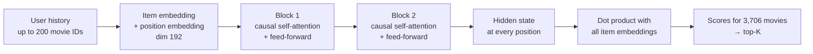
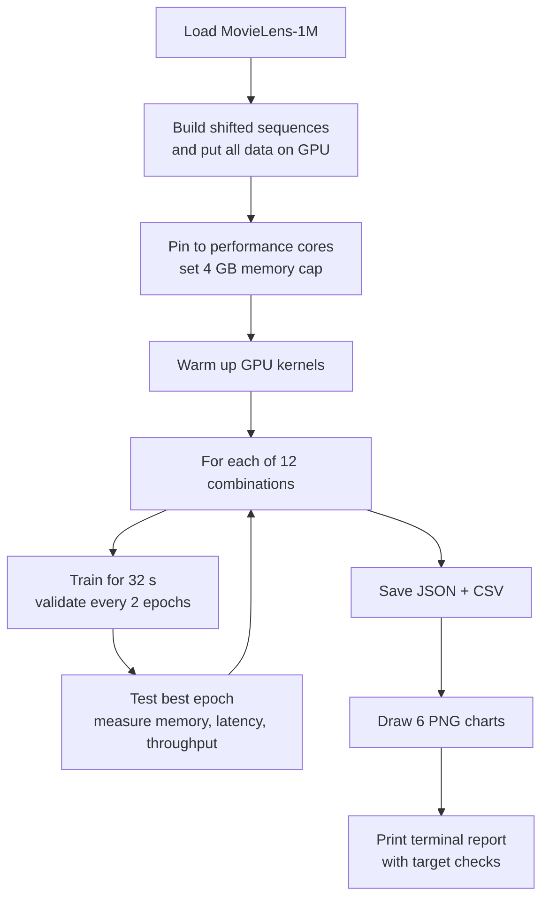

# Sequential Recommendation on Consumer Hardware — Project Brief

**Project:** building on eSASRec (RecSys 2025) to measure which model components give the best accuracy per unit of memory, time and latency on a laptop GPU.
**Team:** 3–4 B.Tech CSE students
**Last updated:** 16 September 2026

---

## How to use this document

- It is written to be handed to people or tools generating a presentation.
- **Every number is measured** — from the code's saved output (`results/benchmark_results.json`, `results_transformer.json`, `results_meanpool.json`) or from checks run on the development laptop — unless it is marked ⚠.
- ⚠ **marks something that must be verified before presenting.** Paper figures were read through a web summariser and should be checked against the original paper's tables.
- Charts are separate PNG files in `results/plots/`. Share that folder together with this file.
- Results come from **the final benchmark run (run 2)**. A first run exists in `results_run1_backup/` from before three bugs were fixed; do not quote it.

---

## 0. At a glance

| | |
|---|---|
| **Research question** | Which combination of SASRec components gives the most accuracy per unit of memory, training time and latency on consumer hardware? |
| **Base paper** | eSASRec — *Enhancing Transformer-based Recommendations in a Modular Fashion*, ACM RecSys 2025 |
| **Dataset** | MovieLens-1M: 1,000,209 ratings · 6,040 users · 3,706 movies |
| **Hardware** | NVIDIA RTX 4050 Laptop GPU (6 GB) · Intel Core i7-12650H |
| **Stack** | Python 3.14.3 · PyTorch 2.14.0 · CUDA 12.6 · NumPy 2.5.3 · matplotlib 3.11.2 |
| **Builds** | **Beta 0.1** (working demo with web app) and a **component benchmark** (12 combinations) |
| **Code size** | 2,756 lines: Beta 0.1 = 1,626 · benchmark = 1,130 |
| **Best accuracy** | Post-LN + Full softmax — **NDCG@10 0.1757, Recall@10 0.3005** |
| **Headline efficiency result** | Post-LN + Sampled softmax — NDCG@10 0.1736 using **1,226 MB**: **47% less GPU memory for 1.2% less accuracy** than the most accurate combination |
| **Speed gain over Beta 0.1** | Same accuracy (0.1742 → 0.1757) in **33 s of training instead of 150 s** (~4.5× less) |
| **Benchmark run** | 12 combinations in **8.2 minutes**; heaviest run **2,590 MB**; all under a 4 GB cap |

---

## 1. Project overview

### 1.1 The problem

A **sequential recommender** predicts what a person will choose next from what they chose before, **in order**. Example: after *Aladdin → Beauty and the Beast → Tarzan → Antz*, predict the next film.

Most production recommenders run on server clusters. Our question: **how good a recommender can be built and trained on a normal laptop, and what does each design choice cost?**

### 1.2 Why eSASRec

- **Recent and strong.** Published at ACM RecSys 2025.
- **Modular.** Rather than inventing new parts, its authors split SASRec into interchangeable components and tested which combinations work best.
- **Each component has a different cost.** Swapping parts changes memory use and speed, which makes it a natural base for a consumer-hardware study.
- **Honest framing.** eSASRec was designed for *accuracy*, not for laptops. The consumer-hardware angle is *our* question built on top of it.

### 1.3 The gap we address

The eSASRec paper reports accuracy and coverage. ⚠ According to our reading, **it reports no hardware, memory or training-time figures.** Our benchmark measures exactly those.

### 1.4 What was built

| Build | Purpose | Status |
|---|---|---|
| **Beta 0.1** | Prove the full pipeline works: data → model → ranking → web app | Complete |
| **Component benchmark** | Compare 12 component combinations on accuracy, memory, time and latency | Complete (one seed per combination) |

---

## 2. Research background

### 2.1 SASRec — the base model

- **Paper:** W.-C. Kang, J. McAuley. *Self-Attentive Sequential Recommendation.* IEEE ICDM 2018.
- **Idea:** give the model a user's history in order. Self-attention learns how much each past item should count toward predicting the next one — a learned, history-dependent weighted average. The model then scores every item and recommends the highest.
- **Classical-ML view:** a classifier with one class per item, whose input is an ordered sequence.

### 2.2 eSASRec — the paper we build on

- **Paper:** *eSASRec: Enhancing Transformer-based Recommendations in a Modular Fashion.* ACM RecSys 2025. arXiv:2508.06450.
- **Winning combination:** SASRec's shifted-sequence training objective + **LiGR** Transformer layers + **sampled softmax** loss.
- **LiGR layer:** pre-normalisation, with each attention and feed-forward output gated by a linear projection followed by a sigmoid.
- **Headline claim** ⚠: NDCG@10 **0.0523 vs 0.0424** for ActionPiece on Amazon Beauty — a **23%** improvement.

**Benchmarks used** ⚠

| Type | Datasets | Split |
|---|---|---|
| Academic | Amazon Beauty, Sports, Toys; MovieLens-1M; MovieLens-20M | Leave-one-out |
| Production-like | MovieLens-20M (138,493 users, 26,744 items); Kion (606,743 users, 10,266 items); BeerAdvocate (22,679 users, 22,264 items) | Global temporal split |

**Metrics:** NDCG@10, Recall@10, Coverage@10, Pareto-optimality (accuracy vs coverage).

**Findings per component** ⚠

| Component | Finding |
|---|---|
| Training objective | Shifted sequence (SASRec's default) stayed Pareto-optimal; alternatives underperformed |
| Layer design | LiGR gave large gains on Kion (+9% NDCG, +280% coverage) and BeerAdvocate; similar results on MovieLens-20M |
| Loss | Sampled softmax beat BCE; gBCE (t = 0.75) gave accuracy/coverage trade-off control on 2 of 3 datasets |
| Negative sampling | Mixed negatives generally lowered NDCG but raised coverage |

### 2.3 Related work referenced

| Work | Why it matters here |
|---|---|
| **BERT4Rec** | Alternative objective: masked-item prediction with two-way attention |
| **gSASRec** — Petrov & Macdonald, RecSys 2023 (Best Paper) | Introduces **gBCE**, correcting overconfidence caused by negative sampling |
| **Scalable Cross-Entropy (SCE)** — Mezentsev et al., RecSys 2024 | Reports up to 100× lower peak memory vs alternatives; a future component |
| **Krichene & Rendle** — KDD 2020 | Sampled ranking metrics can reverse which model looks better → we rank against the full catalogue |
| **Dacrema et al.** — RecSys 2019 (Best Paper) | Only 7 of 18 neural recommenders reproduced; many lost to simple baselines → we keep a simple baseline and guard evaluation |

---

## 3. Technology stack

### 3.1 Hardware (development laptop, verified)

| Component | Detail |
|---|---|
| GPU | NVIDIA GeForce **RTX 4050 Laptop GPU**, 6 GB (6,140 MB reported) |
| CPU | **12th Gen Intel Core i7-12650H** — 10 cores (6 performance + 4 efficiency), 16 threads |
| OS | Windows 11 Home |

⚠ Other team laptops are described as RTX 3060–4060 class. Results on those machines have not been measured.

### 3.2 Software and dependencies

| Package | Version | Used for | Required by |
|---|---|---|---|
| Python | 3.14.3 | Runtime | Both |
| **PyTorch** | 2.14.0+cu126 | Models, training, inference, GPU memory tracking | Both |
| CUDA runtime | 12.6 (bundled with PyTorch) | GPU computation | Both |
| cuDNN | 9.10 (bundled) | GPU neural-network kernels | Both |
| **NumPy** | 2.5.3 | Building sequence arrays | Both |
| **matplotlib** | 3.11.2 | PNG charts | Benchmark only |
| pandas | 3.0.5 | *Installed but never imported — not required* | — |

**Python standard library only:** `http.server` (web server), `json`, `csv`, `argparse`, `urllib`, `zipfile`, `subprocess`, `ctypes` + `winreg` (CPU core detection).

**Deliberately not used:** no web framework (Flask/FastAPI), no front-end framework (React), no chart library in the browser, no database, no cloud service, no Hugging Face `transformers` library.

### 3.3 Installation notes (problems met and solved)

- **Python 3.14 has no PyTorch `cu124` wheels.** Use `cu126`:
  `python -m pip install torch --index-url https://download.pytorch.org/whl/cu126`
- **This Python install has no SSL certificate bundle**, so `urllib` downloads fail. `data.py` automatically falls back to `curl`.

### 3.4 What CUDA and PyTorch are (for Q&A)

- **PyTorch** — Meta's open-source deep-learning library: GPU tensors, automatic gradients, ready-made layers and optimisers.
- **CUDA** — NVIDIA's platform for general computation on its GPUs, with libraries such as cuBLAS (matrix maths) and cuDNN (neural-network operations). **Not written by us**; bundled inside the PyTorch package.

### 3.5 Laptop vs desktop GPUs (context for future hardware testing)

| GPU | Laptop | Desktop | Consequence |
|---|---|---|---|
| RTX 3060 | 6 GB | 12 GB | Same name, double memory → different combinations fit |
| RTX 4060 | 8 GB, power 35–115 W (maker-set) | 8 GB | Same combinations fit; laptop speed varies with power limit |
| RTX 4050 | 6 GB, power 35–115 W | Does not exist | No desktop equivalent |

Sources: Notebookcheck comparisons (see References).

---

## 4. Dataset — MovieLens-1M

### 4.1 Source and licence

- **Publisher:** GroupLens Research, University of Minnesota
- **Page:** https://grouplens.org/datasets/movielens/1m/
- **Download:** https://files.grouplens.org/datasets/movielens/ml-1m.zip (~6 MB)
- **Licence:** research use only; acknowledge in publications; **no commercial or revenue-bearing use without GroupLens permission**
- **Citation:** F. Maxwell Harper and Joseph A. Konstan. 2015. *The MovieLens Datasets: History and Context.* ACM Transactions on Interactive Intelligent Systems 5(4), Article 19. https://doi.org/10.1145/2827872

### 4.2 Files and structure

Three plain-text files, fields separated by `::`, linked by `UserID` and `MovieID`.

| File | Rows | Fields | Example |
|---|---|---|---|
| `ratings.dat` | 1,000,209 | UserID::MovieID::Rating::Timestamp | `1::1193::5::978300760` |
| `movies.dat` | 3,883 | MovieID::Title::Genres | `1::Toy Story (1995)::Animation\|Children's\|Comedy` |
| `users.dat` | 6,040 | UserID::Gender::Age::Occupation::Zip-code | `1::F::1::10::48067` |

### 4.3 Statistics

| Statistic | Value |
|---|---|
| Ratings | 1,000,209 |
| Users | 6,040 |
| Movies rated | 3,706 (of 3,883 listed) |
| Matrix density | 4.47% |
| History length per user | min 20 · median 96 · mean 165.6 · max 2,314 |
| Time span | 2000–2003 |
| Most-rated title | American Beauty (1999) — 3,428 ratings |

**Rating values**

| Stars | 1 | 2 | 3 | 4 | 5 |
|---|---|---|---|---|---|
| Count | 56,174 | 107,557 | 261,197 | 348,971 | 226,310 |

**Interactions per user**

| Ratings | 20–49 | 50–99 | 100–199 | 200–499 | 500–999 | 1000+ |
|---|---|---|---|---|---|---|
| Users | 1,743 | 1,352 | 1,356 | 1,190 | 358 | 41 |

### 4.4 How the data is used

- **Used:** UserID, MovieID, Timestamp (gives the order), movie titles (display only).
- **Ignored:** the rating value (every rating counts as "watched" — *implicit feedback*), genres, all of `users.dat`.
- **Preprocessing:** group ratings by user → sort by time → renumber movies 1–3,706 (0 reserved for padding).
- **Split — leave-one-out:** each user's last item = test, second-last = validation, the rest = training.

---

## 5. Build 1 — Beta 0.1

### 5.1 Purpose

Prove the complete pipeline — data → model → ranking → user-facing app — works end to end.

### 5.2 Models

| | MeanPoolRec (baseline) | TinyTransformerRec (main) |
|---|---|---|
| Idea | Averages the history's embeddings — **ignores order** | Self-attention over the ordered history |
| Embedding size | 64 | 64 |
| Layers | — | 2 × PyTorch built-in `nn.TransformerEncoderLayer` (pre-norm) |
| Attention heads | — | 2 |
| Feed-forward | — | 256 units, GELU, dropout 0.2 |
| Positional information | None | Learned positional embeddings |
| Masking | Padding excluded from average | Causal mask + padded positions zeroed |
| Scoring | Dot product with the shared item-embedding table | Dot product with the shared item-embedding table |
| Parameters | 241,408 | 338,624 |

### 5.3 Training

| Setting | Value |
|---|---|
| Objective | One target per window: `[A]→B`, `[A,B]→C`, … |
| Training examples | 982,089 windows, history up to 20, left-padded |
| Loss | Full softmax cross-entropy over all items |
| Optimiser | Adam, learning rate 0.001 |
| Batch / epochs | 256 / 5 |
| Precision | float32 |

### 5.4 Evaluation protocol (shared with the benchmark)

- Leave-one-out; the held-out item is ranked against **all 3,706 movies** (not sampled)
- Items the user has already seen are masked
- **Pessimistic ties** — a model that scores everything equally cannot record a hit
- Non-finite scores raise an error instead of silently inflating the metric

### 5.5 Results

| Model | Recall@10 | NDCG@10 | Params | Train | Peak GPU | Latency (1 query) | Throughput (batched) |
|---|---|---|---|---|---|---|---|
| TinyTransformerRec | **0.2987** | **0.1742** | 338,624 | 150.5 s | 85 MB | 1.14 ms | 0.074 ms/user |
| MeanPoolRec | 0.1618 | 0.0866 | 241,408 | 40.0 s | 34 MB | 0.30 ms | 0.069 ms/user |

**Validation Recall@10 by epoch**

| Epoch | 1 | 2 | 3 | 4 | 5 |
|---|---|---|---|---|---|
| TinyTransformerRec | 0.2810 | 0.3015 | 0.3075 | 0.3179 | 0.3164 |
| MeanPoolRec | 0.1015 | 0.1339 | 0.1513 | 0.1694 | 0.1752 |

**Interpretation:** respecting order **nearly doubles accuracy**. Caveat: MeanPool was still improving at epoch 5; the Transformer had plateaued.

### 5.6 Web application

- **Server:** Python standard library `ThreadingHTTPServer` — nothing extra to install.
- **Warm-up at startup:** the first GPU call costs ~150 ms of kernel loading and would otherwise be reported as latency.
- **Port guard:** refuses to start if port 8000 is already taken (Windows otherwise allows silent double-binding).

**Four tabs**

| Tab | Function |
|---|---|
| Recommend | Search movies, build an ordered history, get top-K predictions |
| Metrics | Accuracy, cost and latency; training curves |
| Dataset | Statistics, rating and history-length charts, most-rated titles, user browser, dataset links and citation |
| Test on dataset | Pick random real users, select any subset, run the model on each against their actual next movie |

**API endpoints (9):** `/api/info`, `/api/search`, `/api/sample`, `/api/metrics`, `/api/dataset`, `/api/dataset/users`, `/api/random_users`, `POST /api/recommend`, `POST /api/evaluate_user`.

**Verification:** scoring all 6,040 users one request at a time through the web API reproduced the offline **Recall@10 of 0.2987 exactly** (23.5 s).

### 5.7 Observed behaviour — popularity bias

| History | Top recommendations | Verdict |
|---|---|---|
| Aladdin, Beauty and the Beast, Tarzan, Antz, Hercules … | Prince of Egypt, Rescuers Down Under, Anastasia, Mulan | On target |
| Wes Craven's New Nightmare, Freddy's Dead, Pet Sematary II … | Star Wars IV, American Beauty, Braveheart, Schindler's List | Mostly just popular |

Recall@10 cannot show this; Coverage@10 (added in the benchmark) partly does.

### 5.8 Bugs found and fixed during Beta 0.1

| Bug | Effect | Fix |
|---|---|---|
| NaN from fully padded rows | Spread through both layers and zeroed outputs for short histories | Mask padded values instead of padded keys |
| Optimistic tie-breaking | All-zero scores counted as perfect hits — **inflated** Recall@10 (0.3038 reported, corrected to 0.2969 at the time) | Pessimistic ties + non-finite check |
| Batched throughput labelled as latency | Claimed 0.07 ms "per query"; real single-query latency was 1.14 ms (15× slower) | Measure and label both separately |

---

## 6. Build 2 — Component benchmark

### 6.1 Question

Under the **same training-time budget** on the **same laptop GPU**, which combination of layer design and loss gives the best accuracy — and at what memory, time and latency cost?

### 6.2 The component slots

| Slot | Options tested | Fixed or varied |
|---|---|---|
| Training objective | Shifted sequence (SASRec) | Fixed |
| **Layer design** | Post-LN · Pre-LN · LiGR | **Varied** |
| **Loss** | BCE · gBCE · Sampled softmax · Full softmax | **Varied** |
| Negative sampling | Uniform random (1 per position for BCE; 256 per user for gBCE and sampled softmax) | Fixed |

**3 × 4 = 12 combinations.** Our **"LiGR + Sampled softmax"** run is our implementation of **eSASRec's own configuration**.

### 6.3 Model architecture



| Setting | Value |
|---|---|
| Embedding / hidden size | 192 |
| Layers / heads | 2 / 2 (96 dimensions per head) |
| Feed-forward | 768 units (4 × 192), GELU |
| Dropout | 0.2 |
| History length | up to 200 items |
| Attention | Hand-written layers calling PyTorch's `scaled_dot_product_attention`; mask = causal AND real item (diagonal always allowed, preventing NaN rows) |
| Parameters | Post-LN 1,639,872 · Pre-LN 1,640,256 · LiGR 1,788,480 |

**The three layer designs**

| Design | Structure |
|---|---|
| **Post-LN** | `x = Norm(x + Attention(x))`, then `x = Norm(x + FeedForward(x))` — the original Transformer |
| **Pre-LN** | `x = x + Attention(Norm(x))`, then `x = x + FeedForward(Norm(x))`, final norm at the end |
| **LiGR** | Pre-norm, and each output is gated: `x = x + σ(W·Norm(x)) ⊙ Attention(Norm(x))` (same for feed-forward) |

⚠ LiGR is implemented from the paper's description, not from official code.

### 6.4 The four losses

`s⁺` = score of the true next item · `s⁻` = score of a sampled wrong item · `σ` = sigmoid

| Loss | Formula (per position) | Compares the true item against |
|---|---|---|
| **BCE** (original SASRec) | `−log σ(s⁺) − log(1 − σ(s⁻))` | 1 random item |
| **gBCE** (gSASRec) | `−β·log σ(s⁺) − Σ log(1 − σ(s⁻))`, with `β = α·(t·(1 − 1/α) + 1/α)`, `α = k/(items − 1)` | 256 random items; t = 0.75 → β = 0.302 |
| **Sampled softmax** (eSASRec's choice) | Softmax cross-entropy over the true item + k sampled items | 256 random items |
| **Full softmax** | Softmax cross-entropy over the whole catalogue | All 3,706 items |

Accidental hits (a "negative" that is actually the true item) are masked in every sampled loss.

### 6.5 Training procedure

| Setting | Value |
|---|---|
| Objective | Shifted sequence — every position predicts the next item, all in one pass |
| Training targets | 647,619 |
| Batch | 256 users (24 steps per epoch) |
| Optimiser | Adam, learning rate 0.001 |
| Precision | **bf16 mixed precision** |
| Data location | Entire dataset held on the GPU (no per-batch copying) |
| **Budget** | **32 s of training per combination** — equal time, not equal epochs |
| Validation | Every 2 epochs; best validation epoch is evaluated on test |
| Seed | 42 (same initial weights for every combination) |
| Run order | Shuffled with a fixed seed, so laptop heat-up is spread across combinations |
| Warm-up | GPU kernels loaded before timing starts |

### 6.6 Measurement controls

| Control | Why |
|---|---|
| **4,096 MB cap** via `torch.cuda.set_per_process_memory_fraction` | Hard guarantee no run exceeds 4 GB; an over-cap run is recorded, not crashed |
| **Pinned to performance cores** (`benchmark/hardware.py`) | Windows asked which logical CPUs are performance cores; process restricted to them for steadier timing |
| **Latency = median of 7 passes** of 100 single requests | Ignores lucky or unlucky passes |
| **GPU temperature and power** logged per run (`nvidia-smi`) | Slowdowns can be traced to heat or power |
| **Results saved before charts** are drawn | A charting error cannot lose training results |

### 6.7 Metrics

| Metric | Meaning | Classical-ML analogy |
|---|---|---|
| **Recall@10** | Share of users whose real next movie is in the top 10 | Top-10 accuracy |
| **NDCG@10** | Like Recall@10, but rank 1 scores 1.0, rank 2 = 0.63, rank 3 = 0.50, rank 10 = 0.29, beyond 10 = 0 | Top-10 accuracy with partial credit by position |
| **MRR** | Average of 1 / rank of the real next movie | Reciprocal-rank credit |
| **Coverage@10** | Share of the catalogue appearing in at least one user's top 10 | Catches a model that only predicts popular classes |
| **Peak VRAM** | Maximum GPU memory PyTorch allocated during training | Memory cost |
| **Seconds per epoch** | Time for one pass over all users | Training cost |
| **Latency** | Time to answer one request | What a waiting user feels |
| **Throughput** | Users scored per second in batches of 512 | What a bulk job costs |
| **Pareto frontier** | Combinations no other combination beats on both of two measures | Operating points on a trade-off curve |

### 6.8 Workflow



### 6.9 Outputs

| File | Contents |
|---|---|
| `results/benchmark_results.json` | Configuration, every metric per run, training curves, timing |
| `results/benchmark_results.csv` | One row per combination |
| `results/benchmark_log.txt` | Full terminal output |
| `results/plots/pareto_ndcg_vs_coverage.png` | Accuracy vs coverage (the paper's view) |
| `results/plots/pareto_ndcg_vs_vram.png` | Accuracy vs peak GPU memory |
| `results/plots/pareto_ndcg_vs_latency.png` | Accuracy vs latency |
| `results/plots/validation_curves.png` | Validation NDCG@10 over training time, one panel per loss |
| `results/plots/slot_ablation.png` | NDCG@10 and Coverage@10 by loss and layer |
| `results/plots/cost_memory_and_time.png` | Peak memory (with 4 GB cap line) and seconds per epoch |

---

## 7. Benchmark results (final run)

### 7.1 Targets

| Target | Result | Status |
|---|---|---|
| Total time ≤ 10 min | **8.2 min** (data 1 s, warm-up 2 s, runs 488 s, charts 2 s) | PASS |
| Heaviest run within 2–4 GB | **2,590 MB** (3,021 MB as seen by `nvidia-smi`) | PASS |
| Every run ≤ 4,096 MB | Yes | PASS |
| All combinations complete | 12 / 12 | PASS |

9 of 12 runs use under 2 GB **by design**: cheaper losses need less memory, and that saving is a result.

### 7.2 Accuracy (test set, full-catalogue ranking)

`*` = on the accuracy/coverage Pareto frontier

| # | Layer | Loss | NDCG@10 | Recall@10 | MRR | Coverage@10 | Epochs | Best epoch |
|---|---|---|---|---|---|---|---|---|
| 1 | Post-LN | Full softmax | **0.1757** | **0.3005** | 0.1523 | 0.5772 | 16 | 14 * |
| 2 | Post-LN | Sampled softmax | 0.1736 | 0.2972 | 0.1509 | **0.5988** | 20 | 20 * |
| 3 | LiGR | Full softmax | 0.1659 | 0.2877 | 0.1431 | 0.5472 | 14 | 14 |
| 4 | Pre-LN | Full softmax | 0.1577 | 0.2798 | 0.1357 | 0.5440 | 16 | 16 |
| 5 | LiGR | Sampled softmax *(eSASRec's configuration)* | 0.1494 | 0.2659 | 0.1291 | 0.5426 | 16 | 16 |
| 6 | Pre-LN | Sampled softmax | 0.1488 | 0.2651 | 0.1289 | 0.5389 | 19 | 18 |
| 7 | Post-LN | BCE | 0.1272 | 0.2384 | 0.1092 | 0.5267 | 22 | 20 |
| 8 | Pre-LN | BCE | 0.1099 | 0.2106 | 0.0950 | 0.4819 | 21 | 21 |
| 9 | LiGR | BCE | 0.1089 | 0.2020 | 0.0961 | 0.4900 | 18 | 18 |
| 10 | Post-LN | gBCE ⚠ | 0.0173 | 0.0341 | 0.0193 | 0.0526 | 20 | 8 |
| 11 | Pre-LN | gBCE ⚠ | 0.0172 | 0.0336 | 0.0193 | 0.0513 | 20 | 8 |
| 12 | LiGR | gBCE ⚠ | 0.0166 | 0.0316 | 0.0192 | 0.0518 | 16 | 8 |

⚠ gBCE runs collapsed — see section 8.4. Do not present them as evidence that gBCE is worse.

### 7.3 Cost

`*` = on the accuracy/memory Pareto frontier

| Layer | Loss | Params | Peak VRAM (MB) | nvidia-smi (MB) | Train (s) | s/epoch | Latency (ms) | Users/s | GPU °C | Power (W) |
|---|---|---|---|---|---|---|---|---|---|---|
| Post-LN | BCE * | 1,639,872 | **1,129** | 1,813 | 33.1 | **1.50** | 2.58 | 12,361 | 72→62 | 30 |
| Post-LN | gBCE | 1,639,872 | 1,202 | 2,071 | 33.4 | 1.67 | 2.56 | 12,709 | 62→73 | 65 |
| Post-LN | Sampled softmax * | 1,639,872 | 1,226 | 2,105 | 33.2 | 1.66 | 1.74 | 15,045 | 65→66 | 28 |
| Post-LN | Full softmax * | 1,639,872 | 2,324 | 2,779 | 33.1 | 2.07 | 2.47 | 12,447 | 78→74 | 83 |
| Pre-LN | BCE | 1,640,256 | 1,169 | 1,979 | 32.5 | 1.55 | 2.81 | 11,465 | 74→62 | 28 |
| Pre-LN | gBCE | 1,640,256 | 1,241 | 2,105 | 33.5 | 1.68 | 1.78 | 14,577 | 64→65 | 28 |
| Pre-LN | Sampled softmax | 1,640,256 | 1,265 | 2,141 | 32.3 | 1.70 | 1.72 | 14,571 | 81→82 | 82 |
| Pre-LN | Full softmax | 1,640,256 | 2,362 | 2,781 | 33.5 | 2.09 | 1.62 | 14,583 | 62→64 | 27 |
| LiGR | BCE | 1,788,480 | 1,395 | 2,193 | 33.7 | 1.87 | 2.07 | 11,586 | 77→81 | 80 |
| LiGR | gBCE | 1,788,480 | 1,470 | 2,337 | 32.6 | 2.04 | 2.06 | 11,581 | 81→81 | 79 |
| LiGR | Sampled softmax | 1,788,480 | 1,493 | 2,371 | 32.9 | 2.06 | 3.43 | 9,321 | 73→69 | 65 |
| LiGR | Full softmax | 1,788,480 | **2,590** | 3,021 | 34.3 | **2.45** | 2.30 | 11,600 | 82→78 | 76 |

Power is a single reading taken after each run, not an average.

### 7.4 Slot ablation

**By loss (mean of the 3 layer designs)**

| Loss | NDCG@10 | Recall@10 | Coverage@10 | Peak VRAM (MB) | s/epoch |
|---|---|---|---|---|---|
| BCE | 0.1154 | 0.2170 | 0.4996 | 1,231 | 1.64 |
| gBCE ⚠ | 0.0170 | 0.0331 | 0.0519 | 1,304 | 1.79 |
| Sampled softmax | 0.1572 | 0.2760 | **0.5601** | 1,328 | 1.80 |
| Full softmax | **0.1665** | **0.2893** | 0.5561 | 2,425 | 2.20 |

**By layer design (mean of the 4 losses)**

| Layer | NDCG@10 | Recall@10 | Coverage@10 | Peak VRAM (MB) | s/epoch |
|---|---|---|---|---|---|
| Post-LN | **0.1235** | **0.2175** | **0.4388** | **1,470** | **1.72** |
| Pre-LN | 0.1084 | 0.1973 | 0.4040 | 1,509 | 1.75 |
| LiGR | 0.1102 | 0.1968 | 0.4079 | 1,737 | 2.10 |

### 7.5 Pareto frontiers

| Trade-off | Combinations on the frontier |
|---|---|
| Accuracy vs coverage (paper's view) | Post-LN + Full softmax (0.1757, 0.5772) · Post-LN + Sampled softmax (0.1736, 0.5988) |
| Accuracy vs memory (ours) | Post-LN + Full softmax (2,324 MB) · Post-LN + Sampled softmax (1,226 MB) · Post-LN + BCE (1,129 MB) |
| Accuracy vs latency (ours) ⚠ | Post-LN + Full softmax (2.47 ms) · Post-LN + Sampled softmax (1.74 ms) · Pre-LN + Full softmax (1.62 ms) — latency is noisy, see 8.3 |

### 7.6 Key findings

1. **Sampled softmax gives nearly full-softmax accuracy for about half the memory.**
   - Best pair: Post-LN + Sampled softmax reaches NDCG@10 0.1736 vs 0.1757 (**−1.2%**) using 1,226 MB vs 2,324 MB (**−47%**), with *higher* coverage (0.5988 vs 0.5772).
   - Averaged over layers: sampled softmax reaches **94%** of full softmax's NDCG@10 using **1.8× less memory**.
   - This matches the paper's choice of sampled softmax, and adds the memory evidence the paper does not report.
2. **BCE is cheapest but clearly less accurate.** It reaches 73% of sampled softmax's NDCG@10 while saving only ~7% memory on average. Same direction as the paper.
3. **Full softmax costs the most memory.** It is the only loss above 2 GB. Its memory grows with catalogue size, so the gap would widen on larger catalogues.
4. **Post-LN was the best layer design under this budget.** It is also the fastest per epoch (1.72 s vs 2.10 s for LiGR), so it completed more epochs in 32 s.
5. **eSASRec's own configuration (LiGR + Sampled softmax) ranked 5th** (NDCG@10 0.1494). This does **not** show LiGR is worse: LiGR is ~22% slower per epoch, so it got fewer epochs, and its runs were still improving when time ran out. The paper found LiGR helpful with full-length training.
6. **Six of 12 runs were still improving** at the end of the budget. Rankings could change with longer training.

### 7.7 Comparison with Beta 0.1

| | Beta 0.1 (TinyTransformerRec) | Benchmark best (Post-LN + Full softmax) |
|---|---|---|
| NDCG@10 | 0.1742 | 0.1757 |
| Recall@10 | 0.2987 | 0.3005 |
| Training time | 150.5 s | **33.1 s** |
| Peak GPU memory | 85 MB | 2,324 MB |
| History length | 20 | 200 |

Same evaluation protocol, so the accuracy numbers are comparable: **the same accuracy in about 4.5× less training time**, using far more GPU memory. The speed comes from the training method, not from the extra memory (section 8.1).

### 7.8 Reproducibility between runs

Two full runs with the same seed gave near-identical accuracy. Small differences (for example Post-LN + Sampled softmax 0.1758 → 0.1736) come from the time budget: slightly different speed means a slightly different number of epochs.

---

## 8. Engineering investigations and performance insights

### 8.1 Using more GPU memory does not by itself make training faster

**Profiling Beta 0.1's training loop**

| Measure | Value |
|---|---|
| Steps per epoch | 3,837 |
| Time per step | 6.63 ms (CPU batch preparation 3%, GPU compute 97%) |
| Estimated epoch time | 25.4 s |
| **GPU utilisation** | **~49% — half idle** |
| Peak memory | 82 MB |

**Shifted-sequence training, history 200** (early profiling test, dim 64 unless noted)

| Batch | Precision | Time per step | Steps/epoch | Time per epoch | Peak memory |
|---|---|---|---|---|---|
| 128 | float32 | 40.0 ms | 48 | 1.92 s | 1,745 MB |
| 256 | float32 | 82.8 ms | 24 | 1.99 s | 3,436 MB |
| 256 | bf16 | 68.7 ms | 24 | 1.65 s | 2,884 MB |
| 256 (dim 128) | bf16 | 95.6 ms | 24 | 2.30 s | 3,191 MB |

- **Beta 0.1 was slow** because thousands of tiny steps each paid a fixed cost to hand work to the GPU, leaving it idle half the time.
- **Shifted-sequence training** does the same work in 24 large steps: **~12× faster per epoch** with **10× longer histories**. During the benchmark, the GPU ran at **~95% utilisation**.
- **Proof memory isn't the cause:** batch 128 (1.7 GB) and batch 256 (3.4 GB) took the **same time per epoch**. Doubling memory gave no speedup.

### 8.2 Negative sampling: per batch vs per user

- **First version:** one set of 256 negatives shared by the whole batch (~30,000 positions). With only 24 updates per epoch, most movies almost never received a "push down" signal.
- **Symptom:** in short trial runs, sampled softmax scored NDCG@10 ≈ 0.004, and BCE (a fresh negative per position) beat it — the opposite of the paper.
- **Fix:** 256 negatives **per user** — 65,536 negative samples per update for tens of MB of extra memory.
- **Result:** in trial runs sampled softmax rose to NDCG@10 ≈ 0.074, within 4% of full softmax at about half the memory. (Trial settings differed slightly between the before and after runs.)

### 8.3 CPU core type changes single-request latency

The i7-12650H mixes **performance cores (P-cores)** and **efficiency cores (E-cores)**. For a single request the GPU finishes almost instantly, so latency largely measures how fast the CPU dispatches work.

| Process restricted to | Latency (3 rounds) |
|---|---|
| All cores (Windows decides) | 1.72 · 1.45 · 1.47 ms |
| 4 performance-core threads | 2.20 · 1.52 · 1.70 ms |
| 4 efficiency cores | **3.23 · 3.21 · 3.09 ms** |

- **E-cores roughly double latency.**
- In the first unpinned benchmark run, models with an **identical inference path** measured 1.6 ms and 4.5–4.8 ms.
- **Fix:** `benchmark/hardware.py` reads each core's efficiency class from Windows and pins the process to performance cores. A pinned test gave 1.55–1.65 ms over 5 passes.
- ⚠ **Still not fully solved:** in the final run, identical inference paths measured **1.6–3.4 ms**. **Compare combinations on memory and accuracy, not latency.**

### 8.4 gBCE collapse — unresolved

- **Symptom:** every gBCE run recommends only ~5% of the catalogue (NDCG@10 ≈ 0.017) and stops improving by epoch 8, across all three layer designs.
- **Diagnosis** (Post-LN, 12 s trial runs):

| Variant | NDCG@10 | Coverage@10 |
|---|---|---|
| t = 0.75, 256 negatives (β = 0.302) | 0.0173 | 0.0526 |
| **t = 0** (calibration off, β = 1 — plain BCE with 256 negatives) | 0.0183 | 0.0513 |
| t = 0.75, **32 negatives** (β = 0.256) | 0.0162 | 0.0459 |

- **Ruled out:** the calibration formula (t = 0 also collapses) and the scoring code (sampled softmax uses the same negatives and works).
- **Likely cause:** summing many negative terms gives each movie far more "push down" than "push up" signal, and within a short budget the model settles into recommending popular items.
- ⚠ **Status: unresolved.** This contradicts gSASRec and eSASRec, so it is most likely a limitation of our setup — **not evidence that gBCE is worse.**

### 8.5 Other engineering details

| Issue | Fix |
|---|---|
| Windows console crashed printing box-drawing characters | Terminal report uses plain ASCII |
| Output piped to a log file stayed empty until the end | Line-buffered output |
| A short `--only` trial would overwrite full results | Trials save to `results/trial/` |
| Chart labels overlapped | Labels alternate position; bar values rotated |

---

## 9. Beta 0.1 vs benchmark

| | Beta 0.1 | Benchmark |
|---|---|---|
| Purpose | Working demo | Component comparison |
| Models | 1 Transformer + MeanPool baseline | 12 combinations |
| Transformer layer | PyTorch built-in encoder | Hand-written layers on PyTorch's attention function |
| History length | 20 | 200 |
| Model size | dim 64, 339k params | dim 192, 1.64–1.79M params |
| Training method | One target per window (982,089 examples) | Shifted sequence (647,619 targets, one pass per history) |
| Losses | Full softmax | BCE, gBCE, sampled softmax, full softmax |
| Training length | 5 epochs | 32 s per combination |
| Time per epoch | ~30 s | 1.5–2.5 s |
| GPU utilisation | ~49% | ~95% |
| Precision | float32 | bf16 mixed precision |
| GPU memory | 85 MB | 1.1–2.6 GB |
| Metrics | Recall@10, NDCG@10 | + MRR, Coverage@10, Pareto frontiers, ablation |
| Model evaluated on test | Last epoch | Best validation epoch |
| Output | Web app, CLI demo | Terminal report, CSV/JSON, 6 PNG charts |
| **Same in both** | MovieLens-1M · leave-one-out · full-catalogue ranking · seen items masked · pessimistic ties | |

**Beta 0.1 is untouched** by the benchmark build and still runs. The web app still serves Beta 0.1's small model; benchmark models are not saved.

---

## 10. Limitations and honest caveats

- **One seed per combination** — no error bars; differences of a few thousandths of NDCG may be noise.
- **Equal time, not equal epochs** — answers the consumer-hardware question, but differs from the paper's protocol.
- **Half the runs were still improving** when their budget ended.
- **gBCE collapse is unresolved** (section 8.4).
- **Latency comparisons between combinations are unreliable** on this laptop (section 8.3).
- **LiGR and gBCE are our own implementations** from the papers' descriptions.
- **Not directly comparable to the eSASRec paper** — different split, model size, training length and dataset scale.
- **Single dataset (MovieLens-1M), 3,706 items.** Cost differences between losses grow with catalogue size; small catalogues understate them.
- **Single machine.** No other GPUs measured yet.
- **Offline metrics only.** Offline accuracy gains do not always translate into real-world engagement; no online test is possible here.
- **Popularity bias** visible in Beta 0.1's recommendations.
- **Benchmark models are not saved** and not connected to the web app.
- **No version control** — only the latest version of each file exists.
- **Movies, not music** — the implementation guide allows MovieLens for the demo; the architecture is domain-agnostic.

---

## 11. Future work

### 11.1 Next steps

1. Several seeds per combination, with error bars
2. Longer or convergence-based training alongside the equal-time budget
3. Resolve the gBCE collapse
4. Add components: SCE loss, masked-item objective (BERT4Rec), hard and mixed negatives
5. Larger catalogue (MovieLens-20M) where full softmax genuinely strains 6 GB
6. Temporal split, as in the paper's production-like benchmark
7. Run the identical benchmark on other team laptops and a desktop GPU
8. Save the best benchmark model and connect it to the web app
9. Set up Git version control

### 11.2 Prospective additions (proposed; effects are expected, not measured)

| # | Addition | Expected benefit | Difficulty | Reality check on this project |
|---|---|---|---|---|
| 1 | Difficulty-aware adaptive inference | Lower cost and latency, similar accuracy | High | Little headroom on a 2-layer model; overlaps with #7 |
| 2 | Knowledge distillation + adaptive sequence length | Much lower cost and latency, smaller model | High | Good fit; sequence-length sweep already planned |
| 3 | LLM-derived semantic user profiles | Higher accuracy, better cold-start and personalisation | Medium–High | Main generative-AI component; MovieLens-1M has no true cold-start users (all ≥ 20 ratings), so cold start must be simulated; profiles must be generated offline to keep latency flat |
| 4 | Multimodal cold-start model | Better cold-start and coverage; higher cost | High | MovieLens-1M has only title, year and genres — needs external metadata |
| 5 | Two-stage retrieval + reranking | Lower cost and latency on large catalogues | High | Little gain at 3,706 items; benefit appears at 10⁵–10⁶ items |
| 6 | Adaptive hard-negative sampling | Better ranking quality | Medium–High | Overlaps with SCE; watch for false negatives |
| 7 | Early exit / mixture-of-depth | Lower cost and latency | High | A 2-layer model can only exit after layer 1; overlaps with #1 |

**Most demonstrable on this data:** #2 for cost and latency, paired with #3 for accuracy and the generative-AI component.

---

## 12. Practical use cases

| Domain | "Next item" task |
|---|---|
| Video streaming | Next movie or episode to watch |
| Music | Next song in a listening session |
| E-commerce | Next product to view or buy |
| News and content | Next article to read |

**Why consumer hardware matters:**
- Small businesses and student teams without server clusters
- Keeping viewing history on the user's own device
- Choosing a model that fits the hardware actually available — which is exactly what the memory Pareto frontier shows

**Architecture transfer:** the model only needs ordered item IDs, so changing domain means changing the item vocabulary, not the architecture.

---

## 13. Glossary

| Term | Plain explanation |
|---|---|
| **Sequential recommendation** | Predicting the next item from an ordered history |
| **Embedding** | A learned list of numbers representing an item; similar items end up with similar lists |
| **Self-attention** | Each item in the history weighs how much every other item matters — a learned weighted average |
| **Causal mask** | Stops a position from looking at future items |
| **Transformer** | Neural network built from stacked self-attention and feed-forward layers (introduced 2017) |
| **Layer normalisation** | Rescales values inside the network to keep training stable; *pre-norm* applies it before each step, *post-norm* after |
| **Gate (LiGR)** | A learned 0–1 multiplier deciding how much of a layer's output passes through |
| **Loss** | A number measuring how wrong a prediction is; training reduces it |
| **Gradient** | Direction in which each weight should change to increase the loss |
| **Negative gradient / gradient descent** | Moving weights *opposite* to the gradient, so the loss decreases. **Unrelated to negative sampling** |
| **Softmax** | Turns scores into probabilities that sum to 1 |
| **Cross-entropy** | Loss that penalises assigning low probability to the correct answer |
| **Full softmax** | Softmax over every item in the catalogue |
| **Sampled softmax** | Softmax over the correct item plus a random sample of wrong ones — cheaper |
| **BCE (binary cross-entropy)** | Treats each item as a yes/no question: correct item → yes, sampled item → no |
| **gBCE** | BCE with a correction for overconfidence caused by sampling |
| **Negative (sample)** | A wrong item used during training so the model learns what *not* to recommend |
| **Epoch** | One full pass over the training data |
| **Batch** | The group of examples processed in one training step |
| **Adam** | A common optimiser that adapts the step size for each weight |
| **bf16 mixed precision** | Using 16-bit numbers where safe, to save memory and time |
| **VRAM** | Memory on the graphics card |
| **Latency** | Time to answer one request |
| **Throughput** | Requests handled per second when processed in bulk |
| **Leave-one-out** | Hide each user's last item and test whether the model predicts it |
| **Recall@10 / NDCG@10 / MRR / Coverage@10** | See section 6.7 |
| **Pareto frontier** | The set of options where improving one measure means worsening another |
| **Ablation** | Changing one component at a time to see its effect |
| **Popularity bias** | Tendency to recommend popular items regardless of the user |
| **P-core / E-core** | Fast performance cores and slower efficiency cores on modern Intel CPUs |
| **CUDA** | NVIDIA's platform for running computation on its GPUs |

---

## 14. Project structure

| Path | Purpose |
|---|---|
| `data.py` | Download MovieLens, build ordered histories, leave-one-out split |
| `model.py` | Beta 0.1 models: MeanPoolRec, TinyTransformerRec |
| `train.py` | Train a Beta 0.1 model; evaluate; save checkpoint and metrics |
| `demo.py` | Command-line demo |
| `app.py` | Local web server and API |
| `static/index.html` | Browser front end (4 tabs) |
| `checkpoint_transformer.pt`, `checkpoint_meanpool.pt` | Trained Beta 0.1 weights |
| `results_transformer.json`, `results_meanpool.json` | Beta 0.1 metrics |
| `benchmark/run.py` | Benchmark runner and terminal report |
| `benchmark/model.py` | SASRec with swappable layer design |
| `benchmark/losses.py` | The four losses |
| `benchmark/evaluate.py` | Metrics, speed measurement, Pareto frontiers |
| `benchmark/hardware.py` | CPU detection and performance-core pinning |
| `benchmark/plots.py` | PNG charts |
| `results/` | Final benchmark results, log and charts |
| `results/trial/` | Short trial runs (safe to delete) |
| `results_run1_backup/` | First benchmark run before fixes (safe to delete) |
| `data/ml-1m/` | MovieLens-1M files |
| `README.md` | Setup, commands, results, design notes |
| `docs/beta-0.1-synopsis.html` | Beta 0.1 technical synopsis |
| `paper-shortlist.md`, `paper-shortlist-v2.md` | Initial paper research |

---

## 15. Commands

Run everything from the project folder.

```bash
cd "C:\Users\Nitro 5\Desktop\eSASRec(DEMO)"
```

| Task | Command |
|---|---|
| Install PyTorch (GPU) | `python -m pip install torch --index-url https://download.pytorch.org/whl/cu126` |
| Install other packages | `python -m pip install numpy matplotlib` |
| Train Beta 0.1 | `python train.py --model transformer --epochs 5` |
| Beta 0.1 command-line demo | `python demo.py` |
| Beta 0.1 web app | `python app.py` → http://localhost:8000 |
| Full benchmark (~8 min) | `python -m benchmark.run` |
| Re-display benchmark report | `python -m benchmark.run --report-only` |
| Redraw charts | `python -m benchmark.run --report-only --plots` |
| Quick trial | `python -m benchmark.run --only postln:sampled_softmax --budget 10` |

---

## 16. Suggested presentation outline

| Speaker | Content | Sections |
|---|---|---|
| **1 — Introduction** | Problem, research question, why eSASRec, what SASRec is | 1, 2.1–2.2 |
| **2 — Components and metrics** | The four slots, options in each, how combinations form, metric definitions | 6.2–6.4, 6.7 |
| **3 — Results** | Paper's findings, Beta 0.1 starting point, benchmark tables and charts, key findings | 2.2, 5.5, 7 |
| **4 — Conclusion** | What remains to test, hardware differences, future work, use cases | 8.3, 10, 11, 12, 3.5 |

**Likely professor questions**

| Question | Where to find the answer |
|---|---|
| Explain the architecture | 6.3, 5.2 |
| What are the practical use cases? | 12 |
| What is a Transformer / loss / softmax / BCE / negative gradient? | 13 |
| Why not just use more GPU memory to go faster? | 8.1 |
| Why did eSASRec's own configuration not win? | 7.6 point 5 |
| What went wrong along the way? | 5.8, 8.2–8.4 |

---

## 17. References

1. W.-C. Kang, J. McAuley. *Self-Attentive Sequential Recommendation.* IEEE ICDM 2018. https://cseweb.ucsd.edu/~jmcauley/pdfs/icdm18.pdf
2. *eSASRec: Enhancing Transformer-based Recommendations in a Modular Fashion.* ACM RecSys 2025. https://arxiv.org/abs/2508.06450
3. A. Petrov, C. Macdonald. *gSASRec: Reducing Overconfidence in Sequential Recommendation Trained with Negative Sampling.* ACM RecSys 2023. https://arxiv.org/abs/2308.07192
4. G. Mezentsev, D. Gusak, I. Oseledets, E. Frolov. *Scalable Cross-Entropy Loss for Sequential Recommendations with Large Item Catalogs.* ACM RecSys 2024. https://arxiv.org/abs/2409.18721
5. W. Krichene, S. Rendle. *On Sampled Metrics for Item Recommendation.* KDD 2020. https://research.google/pubs/on-sampled-metrics-for-item-recommendation/
6. M. F. Dacrema, P. Cremonesi, D. Jannach. *Are We Really Making Much Progress? A Worrying Analysis of Recent Neural Recommendation Approaches.* ACM RecSys 2019. https://arxiv.org/abs/1907.06902
7. F. M. Harper, J. A. Konstan. *The MovieLens Datasets: History and Context.* ACM TiiS 5(4), 2015. https://doi.org/10.1145/2827872
8. MovieLens 1M dataset. https://grouplens.org/datasets/movielens/1m/
9. Notebookcheck — RTX 3060 laptop vs desktop. https://www.notebookcheck.net/NVIDIA-GeForce-RTX-3060-vs-GeForce-RTX-3060-Laptop-GPU_10960_10478.247598.0.html
10. Notebookcheck — RTX 4060 laptop vs desktop. https://www.notebookcheck.net/NVIDIA-GeForce-RTX-4060-vs-NVIDIA-GeForce-RTX-4060-Laptop-GPU-vs-NVIDIA-GeForce-RTX-4060-Ti-8G_11593_11455_11592.247598.0.html
11. Notebookcheck — RTX 4050 laptop. https://www.notebookcheck.net/NVIDIA-GeForce-RTX-4060-vs-NVIDIA-GeForce-RTX-4050-Laptop-GPU_11593_11457.247598.0.html
